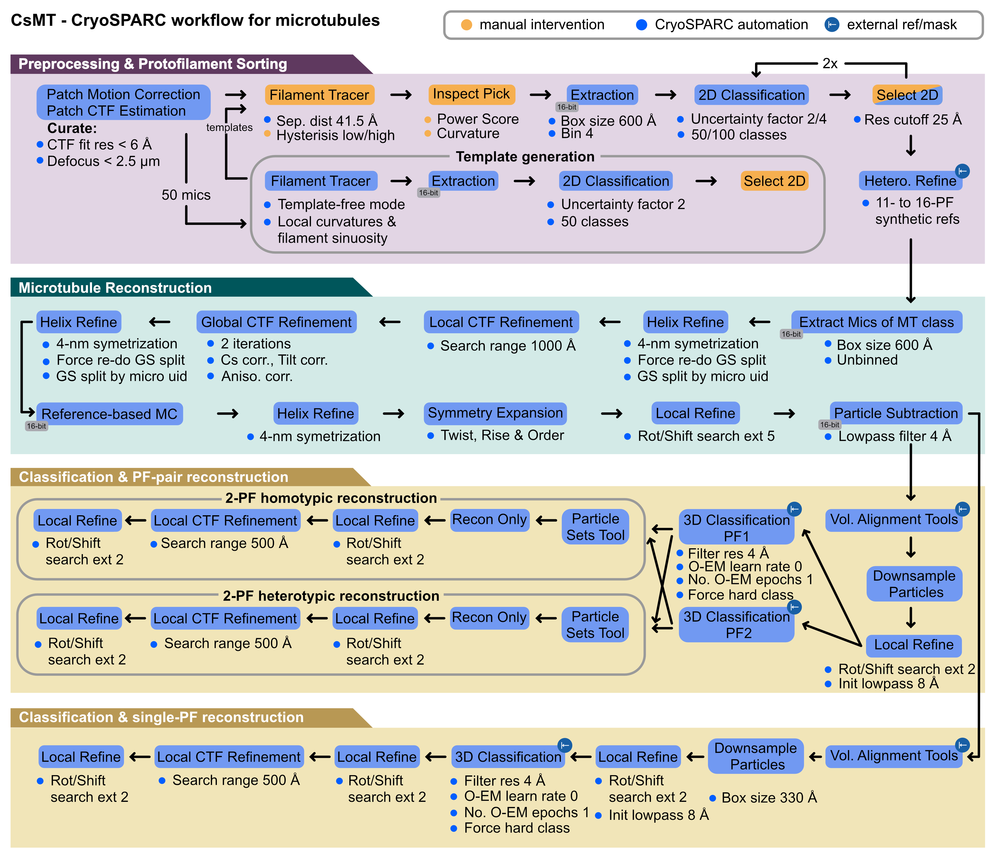

# CsMT — a minimal CryoSPARC workflow for microtubule reconstruction

<p align="center">
  
  

</p>

---

## Table of Contents

- [Overview](#overview)
- [Requirements](#requirements)
- [Workflow Import & Set up](#workflow-import--set-up)
- [Tutorial](#tutorial)
- [Video Guides](#video-guides)
- [References & Citation](#references--citation)
- [Contributing](#contributing)

---

## Overview

**CsMT** is a minimal [CryoSPARC](https://cryosparc.com/)-workflow for cryo-EM reconstruction of decorated and undecorated microtubules developed by the Bui Lab & Cianfrocco Lab. Microtubules present unique challenges for single-particle analysis — including their inherent pseudo-helical symmetry, seam localisation, and decorated states. CsMT workflow uses a protofilament-based classification approach to solve MT structures.

---

## Requirements

The required software dependencies for this workflow are:

| Software | Tested Version | Purpose |
|---|---|---|
| **[CryoSPARC](https://cryosparc.com/)** | `v5.0.6` | Primary processing framework |
| **[UCSF ChimeraX](https://www.rbvi.ucsf.edu/chimerax/)** | `v1.7` | Ref/mask generation & map inspection |

---

## Workflow Import & Set up

For the full detailed explanation of Workflow features, refer to the [CryoSPARC Workflow Guide](https://guide.cryosparc.com/application-guide/workflows).

### Quick Setup

1. **Clone the Repository:** 

   ```bash
   git clone https://github.com/builab/CsMT.git
   ```
   
2.  **Import Workflow into CryoSPARC:**

   * In your CryoSPARC instance, navigate to the **Workflow** sidebar panel.
   * Click **Import** to load the pre-configured workflow JSON from **CsMT**.
   * The `csmt_13pf_v1.X.X` workflow will now appear in your Workflow panel.
   * For your microtubule reconstruction project, create a **Project** and a **Workspace**.
   * Inside that Workspace, select the workflow and click **Apply** to run the CsMT workflow.


3.  **The workflow**

   

## Guideline

   * To come: 
   * Youtube Tutorial of Making References
   * Youtube Tutorial of Making Masks

## Citation

*Tina Alagha, Asuva Arin, Nicolas Vangos, Helena Goodey-Parfitt, Hai Nguyen Ngo, Nhat Nam, Dau, Minh Hoa Nguyen, Thibault Legal, Michael Cianfrocco, Khanh Huy Bui. BioRxiv, 2026


